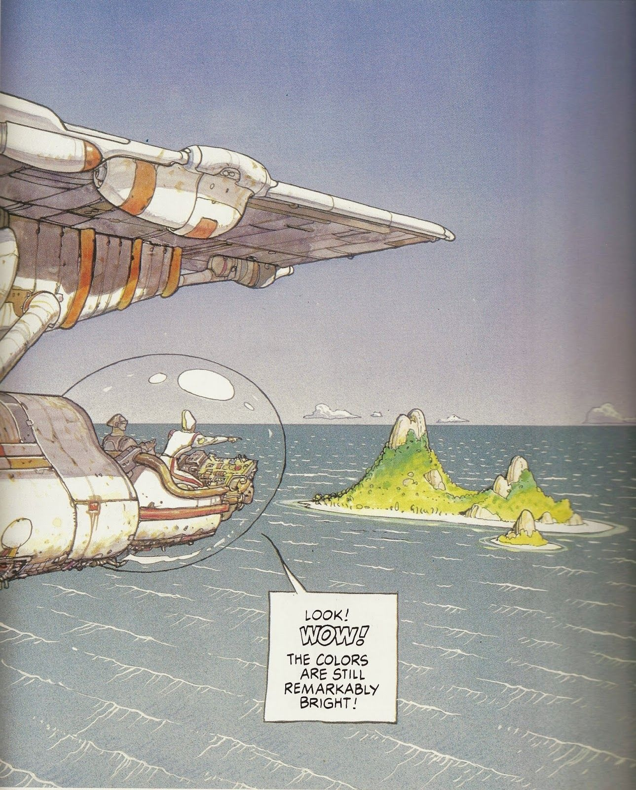
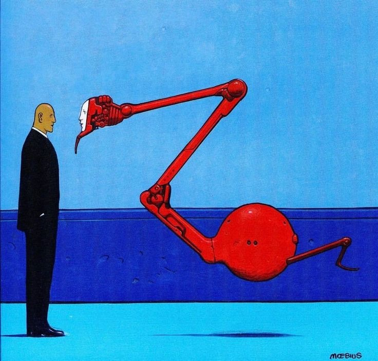

# Homework 1 Assignment
## Team Steak (Yi Cheng, Liam Kuchta)

**Group Member #1**
*Yi*

### My Favorite Website
[Newsblur](https://www.newsblur.com)

### These are the top 3 countries I want to visit the most
1. Japan
2. USA
3. UK

### This is a picture of my minimalist drawing

**Group Member #2**
*Liam*

## Liam's Bio
Hello, my name is Liam Kuchta. I am a traditional artist from London, Ontario. I'm 25 years old. I am also studying web design at Fanshawe. I went backpacking around Europe this past summer and it was the best time of my life. I spent 10 grand. I love to hike mountains which is what i did in switzerland, france, and norway. I plan to make a living from my drawings in the future.

## These are my favorite visual artists:
- David Rappeneau
- Moebius
- Luke Hannam

## These are my favorite Moebius images:

## Credits

Yi Cheng, Liam Kuchta

## License

See license file